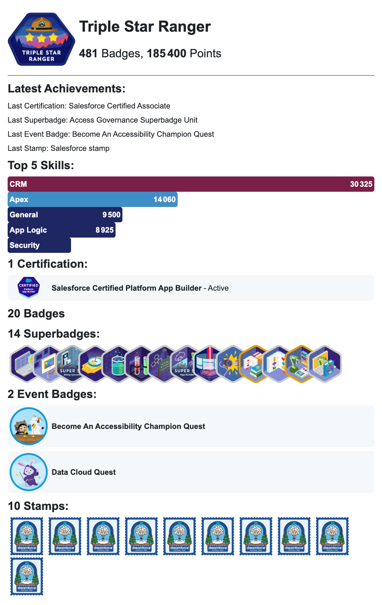

# Trailhead Stats GitHub Action


[](https://github.com/nabondance/Trailhead-Stats/actions/workflows/mega-linter.yml)

[](https://codecov.io/gh/nabondance/Trailhead-Stats)


## Description

**Trailhead Stats** is a GitHub Action created to dynamically display Trailhead
statistics based on a specified Trailhead username. This action can be used to
showcase your Trailhead achievements, such as badges, points and more, directly
in your GitHub repository's README or other Markdown files.

## Usage

### Prerequisites

For the standard use case of having your Trailhead Stats displayed on your
GitHub homepage, you need:

- [Personalized Profile Readme](https://docs.github.com/en/account-and-profile/setting-up-and-managing-your-github-profile/customizing-your-profile/managing-your-profile-readme)
- [Basic GitHub Actions knowledge](https://docs.github.com/en/actions/quickstart)

If you're lost, follow the [quickstart documentation](./QUICKSTART.md).

### GitHub Action

To use this action in your workflow, add the following step:

```yaml
- uses: nabondance/trailhead-stats@v1
  permissions:
    contents: write
  with:
    trailhead-username: 'your_trailhead_username'
    display-type: 'card' # Optional
    display-file: 'README.md' # Optional
    file-format: 'md' # Optional
```

This will fetch your Trailhead stats and display them in the specified format.

### Special Tags in Display File

To insert the Trailhead stats into your display-file (like README.md), you need
to place special comment tags in your file. These tags define where the
Trailhead stats will be inserted or updated.

Insert the following tags in your file:

```markdown
<!--TH_Stats:start-->
<!--TH_Stats:end-->
```

The action will automatically update the content between these tags with the
latest Trailhead stats. Ensure these tags are in place for the action to work
correctly.

### Example Workflow

Here's an example of a complete workflow using the Trailhead Stats action:

```yaml
name: Update Trailhead Stats

on:
  schedule:
    - cron: '0 0 * * *' # Runs daily

jobs:
  update-stats:
    runs-on: ubuntu-latest
    permissions:
      contents: write
    steps:
      - name: Checkout
        uses: actions/checkout@v4
      - uses: nabondance/trailhead-stats@v1
        with:
          trailhead-username: 'your_trailhead_username'
          display-type: 'card'
```

This workflow will update your Trailhead stats in your repository's README.md
daily.

## Inputs

| Input Name           | Kind       | Description                                                        | Default     |
| -------------------- | ---------- | ------------------------------------------------------------------ | ----------- |
| `trailhead-username` | Required   | The username on Trailhead.                                         | `username`  |
| `display-file`       | Config     | The file to update for displaying the Trailhead stats.             | `README.md` |
| `file-format`        | Config     | Format of the file. Options: `md`, `html`.                         | `md`        |
| `card-path`          | Config     | Folder path to save the card                                       | `images`    |
| `display-type`       | Preference | The type of display output. Options: `text`, `card`, `output`.     | `text`      |
| `dark-style`         | Preference | The kind of dark theme. Options: `dimmed`, `dark`, `high-contrast` | `dimmed`    |
| `show-*`             | Preference | On a card, customize the element. See Card Display customization.  |             |
| `output-only`        | Debug      | Set to true to only output without modifying the file.             | `false`     |
| `no-commit`          | Debug      | Set to true to not commit the modification.                        | `false`     |

## Outputs

### `stats`

The fetched Trailhead stats.

## Visual display in your file

| Display Type | Example Light Theme                         | Example Dark Theme                        |
| ------------ | ------------------------------------------- | ----------------------------------------- |
| `text`       |  |  |
| `card`       |  |  |
| `output`     | Object to use in a GitHub Action            | Object to use in a GitHub Action          |

## Card features

### Card Display customization

Theses inputs allows you to select what is displayed and how.

| Input Name                  | Description                                      | Options                                       | Default   |
| --------------------------- | ------------------------------------------------ | --------------------------------------------- | --------- |
| `show-skill`                | Display or hide the skill bar.                   | `hidden`, `visible`                           | `visible` |
| `show-skill-number`         | The max number of skills to display in the card. | any number                                    | `5`       |
| `show-certification-latest` | Display or hide the latest certification.        | `hidden`, `visible`                           | `visible` |
| `show-badge-latest`         | Display or hide the latest badge.                | `hidden`, `visible`                           | `visible` |
| `show-superbadge-latest`    | Display or hide the latest superbadge.           | `hidden`, `visible`                           | `visible` |
| `show-event-badge-latest`   | Display or hide the latest event badge.          | `hidden`, `visible`                           | `visible` |
| `show-stamp-latest`         | Display or hide the latest stamp.                | `hidden`, `visible`                           | `visible` |
| `show-certification`        | How to display the certifications.               | `hidden`, `icon`, `table`, `detail`, `number` | `detail`  |
| `show-badge`                | How to display the badges.                       | `hidden`, `icon`, `table`, `detail`, `number` | `hidden`  |
| `show-superbadge`           | How to display the superbadges.                  | `hidden`, `icon`, `table`, `detail`, `number` | `icon`    |
| `show-event-badge`          | How to display the event badges.                 | `hidden`, `icon`, `table`, `detail`, `number` | `icon`    |
| `show-stamp`                | How to display the stamps.                       | `hidden`, `icon`, `table`, `detail`, `number` | `table`   |

You can see how the stat will look depending on the display option:

| Selected Display Option | Example                                       |
| ----------------------- | --------------------------------------------- |
| `hidden`                |    |
| `visible`               |  |
| `icon`                  |        |
| `table`                 |      |
| `detail`                |    |
| `number`                |    |

### Card theme

#### Dark Theme Styles

According to GitHub, there is different dark themes styles that you can also
select using the input `dark-style`:

| Dark Style      | Example                                                      |
| --------------- | ------------------------------------------------------------ |
| `dimmed`        |                |
| `dark`          |                    |
| `high-contrast` |  |

### Card automatism

Theses features doesn't require any configuration, they are fully automatic

- Card is displayed inside the file selected by `display-file`, with the correct
  format set by `file-format`.
- Clicking on the card will redirect to the trailhead profile.
- The card won't display empty blocs (Certifications, Superbadges, Stamps).
- The Card will be displayed on light or dark theme based on the GitHub theme of
  the user.

## Versions

Consider using a
[released version](https://github.com/nabondance/Trailhead-Stats/releases). You
can specify only a major version in order to automatically get all the new
released features. Thanks to semantic versioning, breaking changes will be in a
new major version.

`uses: nabondance/trailhead-stats@v1`

If you want a specific version, you can specify it:

`uses: nabondance/trailhead-stats@v1.2.3`

## Troubleshooting

Having issues with the Trailhead Stats GitHub Action? Here are some common
problems and their solutions:

### Common Issues

#### 1. **Stats Not Updating**

**Problem:** The Trailhead stats in the README file are not updating.

**Solution:** Ensure that the `<!--TH_Stats:start-->` and `<!--TH_Stats:end-->`
tags are correctly placed in your `display-file`. The action updates the content
between these tags.

---

#### 2. **Git Command Fails**

**Problem:** The Git commands fails during execution.

**Solution:** Check that you granted the content:write permission for the job in
your workflow.

---

#### 3. **GitHub Action Fails**

**Problem:** The GitHub Action fails during execution.

**Solution:** Check the action logs in your repository's "Actions" tab for
specific error messages. Common issues include incorrect input parameters or
network issues.

---

#### 4. **Incorrect Trailhead Username**

**Problem:** The stats displayed do not match your Trailhead profile.

**Solution:** Verify that the `trailhead-username` input is correctly set to
your Trailhead username. The username should match exactly with your Trailhead
profile.

---

### Advanced Troubleshooting

If you're experiencing other issues, try the following steps:

- **Check GitHub Action Version:** Ensure you are using the latest version of
  the Trailhead Stats GitHub Action.
- **Review Workflow File:** Double-check your workflow file for syntax errors or
  misconfigurations.
- **Manual Trigger:** Try running the workflow manually from the "Actions" tab
  to see if the issue persists.

Still need help? Feel free to open an issue on the
[GitHub repository](https://github.com/nabondance/Trailhead-Stats/issues) with a
detailed description of your problem.

## Customization

You can customize the action by changing the input parameters as per your
requirement.

## Contribution

Contributions to the Trailhead Stats GitHub Action are welcome. Please feel free
to fork the repository, make changes, and create a pull request.

## Real world uses

Feel free to create a PR to add your personal example

- [nabondance README.md](https://github.com/nabondance/nabondance/blob/master/README.md#--my-trailhead-stats)

## Future Features

Ideas I have in mind, in no particular order:

- Select the language
- More data
- Add more options to select what to display
- Find a way to remove the required permission
- Dynamic card and not static PNG

## Abandoned Features

**Feature:** Any stat depending of the earning date of a badge.

**Reason:** Earned Date not available without login.
