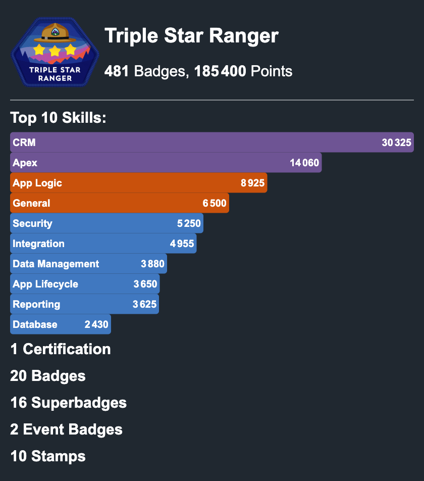

# Card Examples

## Infinity

There's lots of combination of inputs possible to really build the card as you
want. You can find the available inputs in the
[README](README.md#card-features).

## Real world uses

Feel free to create a PR to add your personal example.

- [nabondance README.md](https://github.com/nabondance/nabondance/blob/master/README.md#--my-trailhead-stats)

## Examples

Bellow are some examples of inputs and the effect on the card. All examples have
the same data, the only difference is the inputs. Feel free to copy past the
inputs you like and customize them even further.

List of examples:

- [Default](#default)
- [Summary Only](#summary-only)
- [Focus on Certification](#focus-on-certification)
- [Numbers Lover](#numbers-lover)
- [Maxi Details](#maxi-details)
- [All over the table](#all-over-the-table)
- [Spooky](#spooky)
- [Up-to-date fan](#up-to-date-fan)

---

### Default

```yml
with:
  trailhead-username: th-username
  display-type: 'card'
```

| Card on Light Theme                                                    | Card on Dark Theme                                                     |
| ---------------------------------------------------------------------- | ---------------------------------------------------------------------- |
|  |  |

---

### Summary Only

```yml
with:
  trailhead-username: th-username
  display-type: 'card'
  showSkill: 'hidden'
  showCertification: 'hidden'
  showBadge: 'hidden'
  showSuperBadge: 'hidden'
  showEventBadge: 'hidden'
  showStamp: 'hidden'
  showCertificationLatest: 'hidden'
  showBadgeLatest: 'hidden'
  showSuperBadgeLatest: 'hidden'
  showEventBadgeLatest: 'hidden'
  showStampLatest: 'hidden'
```

| Card on Light Theme                                                    | Card on Dark Theme                                                     |
| ---------------------------------------------------------------------- | ---------------------------------------------------------------------- |
|  |  |

---

### Focus on Certification

```yml
with:
  trailhead-username: th-username
  display-type: 'card'
  showSkill: 'hidden'
  showCertification: 'detail'
  showBadge: 'hidden'
  showSuperBadge: 'hidden'
  showEventBadge: 'hidden'
  showStamp: 'hidden'
  showCertificationLatest: 'visible'
  showBadgeLatest: 'hidden'
  showSuperBadgeLatest: 'hidden'
  showEventBadgeLatest: 'hidden'
  showStampLatest: 'hidden'
```

| Card on Light Theme                                                  | Card on Dark Theme                                                   |
| -------------------------------------------------------------------- | -------------------------------------------------------------------- |
|  |  |

---

### Numbers Lover

```yml
with:
  trailhead-username: th-username
  display-type: 'card'
  showSkillNumber: 10
  showSkill: 'visible'
  showCertification: 'number'
  showBadge: 'number'
  showSuperBadge: 'number'
  showEventBadge: 'number'
  showStamp: 'number'
  showCertificationLatest: 'hidden'
  showBadgeLatest: 'hidden'
  showSuperBadgeLatest: 'hidden'
  showEventBadgeLatest: 'hidden'
  showStampLatest: 'hidden'
```

| Card on Light Theme                                                    | Card on Dark Theme                                                     |
| ---------------------------------------------------------------------- | ---------------------------------------------------------------------- |
|  |  |

---

### Maxi Details

```yml
with:
  trailhead-username: th-username
  display-type: 'card'
  showSkill: 'visible'
  showCertification: 'detail'
  showBadge: 'detail'
  showSuperBadge: 'detail'
  showEventBadge: 'detail'
  showStamp: 'detail'
  showCertificationLatest: 'hidden'
  showBadgeLatest: 'hidden'
  showSuperBadgeLatest: 'hidden'
  showEventBadgeLatest: 'hidden'
  showStampLatest: 'hidden'
```

| Card on Light Theme                                                     | Card on Dark Theme                                                      |
| ----------------------------------------------------------------------- | ----------------------------------------------------------------------- |
|  |  |

---

### All over the table

```yml
with:
  trailhead-username: th-username
  display-type: 'card'
  darkStyle: 'dark'
  showSkillNumber: 3
  showSkillTheme: 'olympic'
  showSkill: 'visible'
  showCertification: 'detail'
  showBadge: 'icon'
  showSuperBadge: 'icon'
  showEventBadge: 'icon'
  showStamp: 'icon'
  showCertificationLatest: 'hidden'
  showBadgeLatest: 'hidden'
  showSuperBadgeLatest: 'hidden'
  showEventBadgeLatest: 'hidden'
  showStampLatest: 'hidden'
```

| Card on Light Theme                                              | Card on Dark Theme                                               |
| ---------------------------------------------------------------- | ---------------------------------------------------------------- |
|  |  |

---

### Spooky

```yml
with:
  trailhead-username: th-username
  display-type: 'card'
  darkStyle: 'high-contrast'
  showSkillNumber: 6
  showSkillTheme: 'halloween'
  showSkill: 'visible'
  showCertification: 'detail'
  showBadge: 'hidden'
  showSuperBadge: 'icon'
  showEventBadge: 'hidden'
  showStamp: 'icon'
  showCertificationLatest: 'hidden'
  showBadgeLatest: 'hidden'
  showSuperBadgeLatest: 'hidden'
  showEventBadgeLatest: 'hidden'
  showStampLatest: 'hidden'
```

| Card on Light Theme                                                  | Card on Dark Theme                                                   |
| -------------------------------------------------------------------- | -------------------------------------------------------------------- |
|  |  |

---

### Up-to-date fan

```yml
with:
  trailhead-username: th-username
  display-type: 'card'
  showSkillTheme: 'winter'
  showSkill: 'visible'
  showCertification: 'detail'
  showBadge: 'hidden'
  showSuperBadge: 'icon'
  showEventBadge: 'icon'
  showStamp: 'icon'
  showCertificationLatest: 'visible'
  showBadgeLatest: 'visible'
  showSuperBadgeLatest: 'visible'
  showEventBadgeLatest: 'visible'
  showStampLatest: 'visible'
```

| Card on Light Theme                                                      | Card on Dark Theme                                                       |
| ------------------------------------------------------------------------ | ------------------------------------------------------------------------ |
|  |  |
